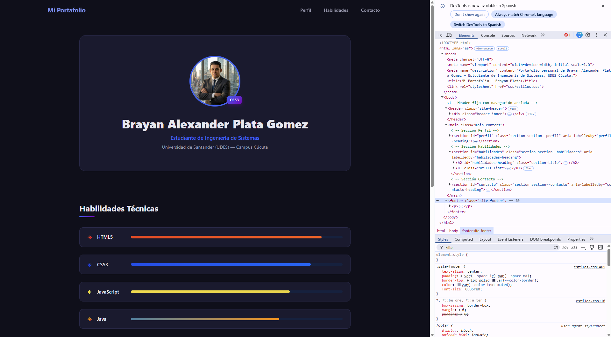
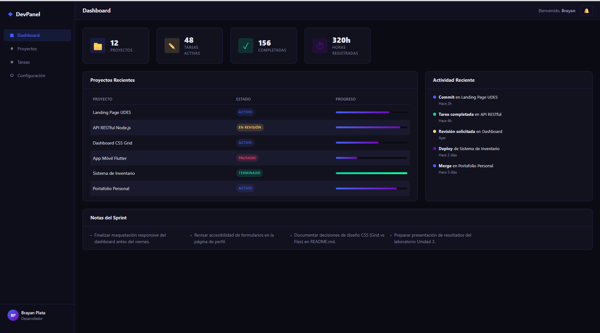
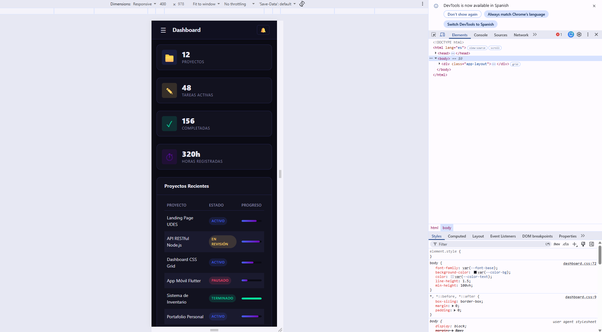

# Laboratorio Unidad 3 — Post-contenido (Parte 1 y Parte 2)

**Estudiante:** Brayan Alexander Plata Gomez  
**Carrera:** Ingeniería de Sistemas  
**Universidad:** Universidad de Santander (UDES) — Campus Cúcuta  
**Código:** 02230132025

---

## Descripción General

Laboratorio práctico de la Unidad 3 que aborda dos ejercicios complementarios de maquetación web con CSS3 puro (sin frameworks externos):

1. **Parte 1 — Página de Perfil con CSS3 Avanzado:** tarjeta de perfil personal con posicionamiento, tipografía fluida, metodología BEM, formulario accesible y validación visual.
2. **Parte 2 — Dashboard con Flexbox y CSS Grid:** panel de administración con layout de dos ejes, grid areas, grid responsivo nativo y media queries para adaptación móvil.

---

## Instrucciones de Visualización

1. Abrir el proyecto en **Visual Studio Code**.
2. Instalar la extensión **Live Server** (Ritwick Dey) si no está instalada.
3. Navegar a cada parte y hacer clic derecho sobre `index.html` → **"Open with Live Server"**.

| Parte | Ruta del archivo |
|-------|-----------------|
| Parte 1 — Perfil | `parte-1-perfil-css3/index.html` |
| Parte 2 — Dashboard | `parte-2-dashboard-grid/index.html` |

---

## Estructura del Proyecto

```
PLATA_post1_u3/
├── parte-1-perfil-css3/
│   ├── index.html
│   ├── css/
│   │   └── estilos.css
│   └── img/
│       ├── perfil.jpg
│       └── captura-01.png
├── parte-2-dashboard-grid/
│   ├── index.html
│   ├── css/
│   │   └── dashboard.css
│   └── img/
│       ├── captura-01.png
│       └── captura-02.png
├── README.md
└── .gitignore
```

---

## Decisiones de Diseño

### 1. Parte 1: Estrategia de especificidad para `:invalid` sin `!important`

Se implementó la **Estrategia A** (`input:invalid:not(:placeholder-shown)`) para los estados de validación del formulario de contacto. Esta técnica combina dos pseudo-clases para activar el borde de error **únicamente cuando el usuario ya ha comenzado a escribir** y el valor ingresado no cumple las restricciones HTML5.

**Justificación técnica:** Al usar `not(:placeholder-shown)` se evita que los campos aparezcan en rojo al cargar la página (cuando están vacíos y técnicamente son `:invalid` por el atributo `required`). El selector `.contact-form input:invalid:not(:placeholder-shown)` tiene una especificidad de `0-3-1`, suficiente para sobreescribir el estilo base del `.form-input` (especificidad `0-1-0`) sin necesidad de recurrir a `!important`.

### 2. Parte 2: Breakpoint y estrategia de layout responsivo

- **Breakpoint elegido:** `768px` (`max-width: 768px`).
- **Justificación:** 768px es el ancho estándar de tablets en orientación vertical (iPad clásico). Por debajo de este punto, el sidebar de navegación deja de ser funcional en pantallas reducidas, por lo que se oculta y el layout se reorganiza a una sola columna.

**Estrategia Grid vs Flexbox:**

| Componente | Técnica | Razón |
|------------|---------|-------|
| `.app-layout` | CSS Grid (`grid-template-areas`) | Layout de 2 dimensiones (filas y columnas simultáneamente); las grid areas permiten reorganizar el layout completo con una sola media query. |
| `.sidebar` | Flexbox (`flex-direction: column`) | Distribución vertical de un solo eje; `flex: 1` en la navegación empuja el footer del sidebar al fondo automáticamente. |
| `.topbar` | Flexbox (`justify-content: space-between`) | Alineación horizontal de dos bloques en extremos opuestos; problema unidimensional ideal para Flexbox. |
| `.stats-row` | CSS Grid (`auto-fill + minmax`) | Grid responsivo nativo que redistribuye las tarjetas automáticamente sin media queries, aprovechando el algoritmo de auto-placement. |
| `.content-row` | CSS Grid (`2fr 1fr`) | Control de proporciones precisas entre la columna principal y la lateral; `grid-column: 1 / -1` en `.card--notes` fuerza el ancho completo. |

---

## Capturas de Pantalla

### Parte 1 — Página de Perfil (escritorio)


### Parte 2 — Dashboard (escritorio)


### Parte 2 — Dashboard (móvil)


---

## Tecnologías Utilizadas

- HTML5 semántico
- CSS3 puro (Custom Properties, Flexbox, CSS Grid, clamp(), pseudo-clases, pseudo-elementos)
- Metodología BEM para nomenclatura de clases
- Git y GitHub para control de versiones

---

> Desarrollado como parte del laboratorio de la Unidad 3 — Programación Web, UDES Cúcuta.